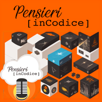
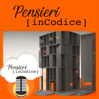
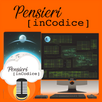
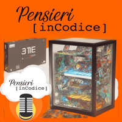
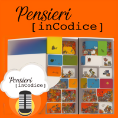
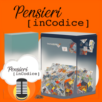
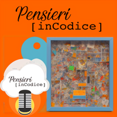
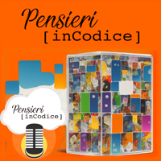
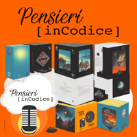

# PIC_Drafts

### This is a space to collect our ideas about PIC

## USAGE

```
git clone https://github.com/fatualux/pensieriincodice-drafts
```

## DEPENDENCIES

- git

## ACKNOWLEDGMENTS

This README file is still a WIP


## LICENSE

[](http://www.gnu.org/licenses/gpl-3.0)

This project is licensed under the GPLv3 license.
See LICENSE file for more details.

##La trappola della semplicità (riflessioni dal containerday 2023)

<div class="gallery">
  <a href="images/container_day-01.png"></a>
  <a href="images/container_day-02.png"></a>
  <a href="images/container_day-03.png"></a>
  <a href="images/container_day-04.png"></a>
  <a href="images/container_day-05.png"></a>
  <a href="images/container_day-06.png"></a>
  <a href="images/container_day-07.png"></a>
  <a href="images/container_day-08.png"></a>
  <a href="images/container_day-09.png"></a>
  <a href="images/container_day-10.png"></a>
  <a href="images/container_day-11.png"></a>
</div>
</body>
</html>

